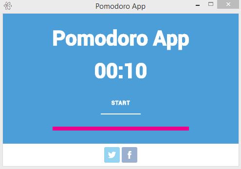

Pomodoro App
=======
*Read this in other languages: [English](README.md), [Português - BR](README.pt-br.md).*

A minimal [Pomodore technique](https://en.wikipedia.org/wiki/Pomodoro_Technique) application to help you control your focus.

## Contributing
1. [Follow this guide](CONTRIBUTING.md)
2. [Fork it](https://github.com/ftonato/pomodoro-app/fork)
3. Create your feature branch: `git checkout -b my-new-feature`
4. Commit your changes: `git commit -am 'Add some feature'`
5. Push to the branch: `git push origin my-new-feature`
6. Create a new Pull Request

## License
Code licensed under an [MIT-style License](LICENSE.md).
